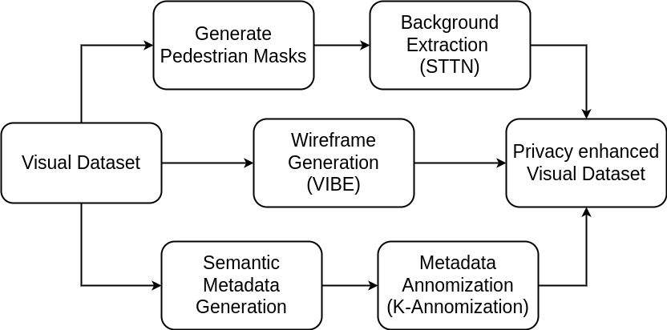

# privacyFrameworkWithMetadata

## Proposed system

## Progress 
- Integrated [ByteTrack](https://github.com/ifzhang/ByteTrack) for tracking pedestrians across the frames
- Using Faster-rcnn for object detection and seperating the all the pedestrians from it
- Interated PARE into existing pipeline
- Able extract Metadata for each img
- Integrated STTN for background extraction

## Feature Fusion using Siamese Network
- Need to extract SMPL images for the MARS dataset
- Build & Train Siamese Network using MARS dataset SMPL models and Metadata tags
### Issues
- Background
  - Rendering the SMPL mesh on top of the existing image
    - Siamese Network might pickup existing overlapping information?
  - Rendering the SMPL on empty backgroung ?
    - Restricting the model to learn background information ?
  

## TODO
- Replace SORT with ByteTrack in VIBE
- AttrNet
  - Following from [Rethinking of PAR](https://github.com/valencebond/Rethinking_of_PAR) and [Strong Baseline of Pedestrian Attribute Recognistion](https://github.com/aajinjin/Strong_Baseline_of_Pedestrian_Attribute_Recognition) , Input pedestrian image size is considered as 256(height) x 192(width)
- ### Classifier 
  - Following are the few designs for the classifiers
    - [pedestrian-attribute-recognision-pytorch](https://github.com/dangweili/pedestrian-attribute-recognition-pytorch)
      - A Single FC layer with i/p 2048 and o/p of no.of pedestrian attributes [ref](https://github.com/dangweili/pedestrian-attribute-recognition-pytorch/blob/468ae58cf49d09931788f378e4b3d4cc2f171c22/baseline/model/DeepMAR.py#L41)
    - [Strong_Baseline_of_Pedestrian_Attribute_Recognition](https://github.com/aajinjin/Strong_Baseline_of_Pedestrian_Attribute_Recognition)
      - A single FC layer with i/9 2048 and o/p of no.of pedestrian attributes [ref](https://github.com/aajinjin/Strong_Baseline_of_Pedestrian_Attribute_Recognition/blob/4b1afcc76b4bbc116f6648f4fd9fbe18502390ee/models/base_block.py#L11)

## Notes
- Command to run
  `python pipeline.py --src_imgs /home/akunchala/Documents/z_Datasets/MOT16/test/MOT16-08/imgTest/`
- Tracking BBOX conversion
  - multipersontracker is using YoLo Detector SORT to track multiple pedestrians across frames and returns the bbox in YOLO format ([x_center, y_center, width, height]), In BYTETracker bboxes are extracted in PascalVOC format ([x_min, y_min, x_max, y_max]). To use the BYTETracker, I converted PascalVOC format to YOLO format. [Conversion Reference](https://github.com/mkocabas/multi-person-tracker/blob/2803ac529dc77328f0f1ff6cd9d36041e57e7288/multi_person_tracker/mpt.py#L133)
    
- Do we need to look for SOTA pedestrian attribute recognision?
  - I'm currently using transfer learning to make a model. May be for later stage, we can look into [Rethinking of PAR](https://github.com/valencebond/Rethinking_of_PAR)

- Tracklets bbox image naming convention
  - F"t_{tIds[i]}-{os.path.basename(imgName)}"
- Color used for meshes (Generated a random color and using it across it)
  - `mc = (0.5, 0.9108974590556427, 1.0)`
- Common shape used for meshes
  - `avg_shape = np.array([[0.00495731,-0.00761945,-0.01329031,-0.01045073,0.02202598,0.0265389 ,-0.01466284,-0.01419266,-0.02254305,-0.010054 ]])`

## Useful functions
  1. 'checkTrackAttrs()'
    - used to check the metadata for each tracklets
      - Might be useful when using k-annomization
  2. 'runByteTracker()'
    - run the byteTracker for given images